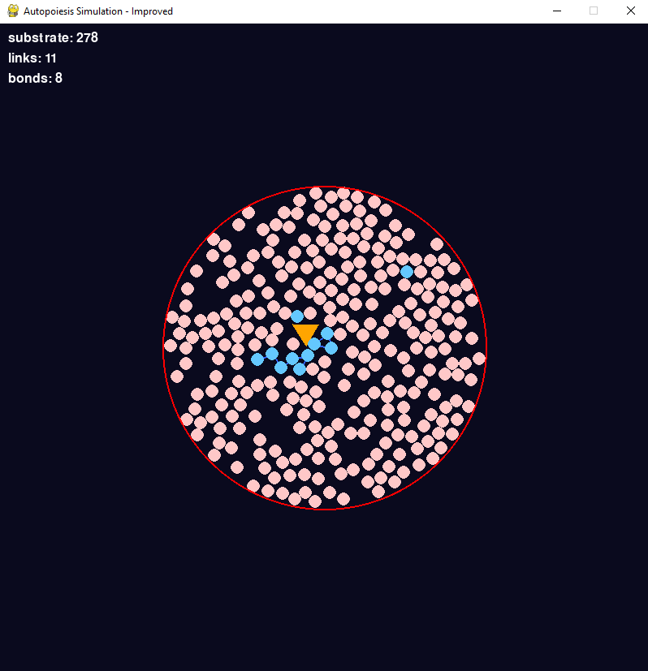

# Autopoiesis Simulation: Cellular Automata in Liquid Environment

This project is a Python-based simulation of **autopoiesis**, inspired by the work of **Humberto Maturana** and **Francisco Varela**. It aims to build a model of self-organizing cellular automata in a liquid-like environment, where particles (substrates, catalysts, and links) interact dynamically to form and maintain structures. The simulation is built using **Pygame** for visualization and **Pymunk** for physics-based interactions.

 



---

## Table of Contents
1. [Introduction](#introduction)
2. [Features](#features)
3. [Installation](#installation)
4. [Usage](#usage)
5. [Contributing](#contributing)
6. [License](#license)
7. [Acknowledgments](#acknowledgments)

---

## Introduction

Autopoiesis refers to the self-maintaining and self-producing nature of living systems. This simulation explores the concept by modeling particles in a liquid environment that interact to form bonds, catalyze reactions, and maintain their structure over time. The simulation is a simplified representation of the principles outlined in Maturana and Varela's work, providing a visual and interactive way to understand autopoietic systems.

---

## Features

- **Dynamic Particle Interactions**: Substrates, catalysts, and links interact based on physical and chemical rules.
- **Brownian Motion**: Particles move randomly, simulating a liquid environment.
- **Self-Organization**: Particles form bonds and structures dynamically.
- **Real-Time Visualization**: Built with Pygame for real-time rendering of the simulation.
- **Physics-Based Interactions**: Uses Pymunk for realistic physics simulations.
- **Statistics Tracking**: Tracks the number of substrates, links, and bonds in real-time.

---

## Installation

1. **Clone the Repository**:
   ```bash
   git clone https://github.com/jancarauma/autopoiesis-simulation.git
   cd autopoiesis-simulation
   ```
2. Install Dependencies:
Ensure you have Python 3.7+ installed. Then, install the required libraries:
   ```bash
   pip install pygame pymunk
   ```
3. Run the Simulation:
   ```bash
   python autopoiesis_simulation.py
   ```
   
## Usage
- Run the Simulation: Execute the script to start the simulation.
- Observe Interactions: Watch as substrates, catalysts, and links interact to form bonds and structures.
- Track Statistics: Monitor the number of substrates, links, and bonds in real-time.
- Exit: Press ESC or close the window to stop the simulation.

## Contributing
Contributions are welcome! If you'd like to contribute, please follow these steps:

- Fork the repository.
- Create a new branch for your feature or bugfix.
- Commit your changes.
- Submit a pull request.

Please ensure your code follows the project's style and includes appropriate documentation.

## License
This project is licensed under the MIT License. See the LICENSE file for details.

## Acknowledgments
Inspired by the work of Humberto Maturana and Francisco Varela on autopoiesis.

Built using Pygame and Pymunk.

Special thanks to the open-source community for their invaluable tools and resources.

## Future Work
- Add more complex particle interactions.
- Introduce environmental factors (e.g., temperature, pH).
- Improve visualization and user interface.
- Optimize performance for larger simulations.

Enjoy exploring! 🌱
